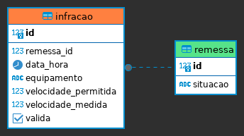

## Desafios Kopp 

Autor: Jonathan Willian dos Santos

### Primeiro Desafio

#### Descrição

O primeiro desafio consiste no desenvolvimento de uma classe **Java** para gerar um tipo de relatório com base numa lista de valores.
O relatório será gerado no seguinte formato:

Para uma entrada de dados como:

```javascript
Arrays.asList(88.00, 130.00, 54.90, 293.30, 44.80);
```

O seguinte será o output:

```shell
"Remessa gerada: 1 cujo valor é R$ 10,00, 2 cujo valor é R$ 88,00, 3 cujo valor é R$ 130,00, 4 cujo valor é R$ 54,90, 5 cujo valor é R$ 293,30, 6 cujo valor é R$ 44,80. Total = R$ 621,00."
```

#### Solução

Para a solução do problema foi utilizada uma arquitetura de projeto baseado em MVC. Possuindo as seguintes classes:

- **Item**: Classe que representa o modelo de um item do relatório. Possui um número de identificação e um valor.
```java
public class Item {
  private final Long id;
  private Double price;
}
```

- **ItemRepository**: Nesta classe está contida a lógica para o armazenamento, recuperação e contagem de itens.
```java
public interface ItemRepository {
  Item save(Item item);
  List<Item> findAll();
}
```

- **ItemService**: Classe que contém a lógica de negócio.  
```java
public interface ItemService {
    Item save(Item item);
    List<Item> saveAll(List<Item> items);
    String makeReport();
}
```

Não foi implementada a classe de 'Controller', pois não foi necessário criar uma interface de comunicação com o usuário.
Além disso, foram desenvolvidos testes unitários utilizando JUnit 5.

#### Como Testar

O teste de utilização será feito direto na `Main` class. 
Para modificar os valores de entrada, basta alterar o array de `Double` como no seguinte exemplo:

```java
public class Main {
    public static void main(String[] args) {
        // Injeção de dependência
        ItemRepository itemRepository = new ItemRepositoryImpl();
        ItemService itemService = new ItemServiceImpl(itemRepository);

        // Testando com uma lista de valores
        List<Double> prices = List.of(10.0, 88.0, 130.0, 54.9, 293.3, 44.8); // Modifique aqui
        List<Item> items = itemsFromList(prices);
        itemService.saveAll(items);
        System.out.println(itemService.makeReport());
    }
    
    // Helper para converter uma lista de Double em uma lista de Item. Apenas como exemplo.
    private static List<Item> itemsFromList(List<Double> prices) {
        List<Item> items = new ArrayList<>();
        prices.forEach(price -> items.add(new Item(price)));
        return items;
    }
}
```

Você também pode adicionar um item de cada vez, como no exemplo abaixo:

```java
public class Main {
    public static void main(String[] args) {
        // Injeção de dependência
        ItemRepository itemRepository = new ItemRepositoryImpl();
        ItemService itemService = new ItemServiceImpl(itemRepository);
        
        // Testando um por um
        itemService.save(new Item(10.0));
        itemService.save(new Item(88.0));
        itemService.save(new Item(130.0));
        itemService.save(new Item(54.9));
        itemService.save(new Item(293.3));
        itemService.save(new Item(44.8));
        System.out.println(itemService.makeReport());
    }
}
```

Em ambos os casos o relatório gerado será o mesmo:

```shell
"Remessa gerada: 1 cujo valor é R$ 10,00, 2 cujo valor é R$ 88,00, 3 cujo valor é R$ 130,00, 4 cujo valor é R$ 54,90, 5 cujo valor é R$ 293,30, 6 cujo valor é R$ 44,80. Total = R$ 621,00."
```

> _**Nota**:_ é possível utilizar o método `itemService.clear()` para limpar o repositório de itens.

### Segundo Desafio

</img>

```postgresql
-- Uma remessa de infração possui uma indentificação númerica, total de infrações;
-- Cada remessa possui somente uma situação que podem ser Criada, Expedida, Aceita e Não
-- Aceita;

CREATE TABLE remessa
(
    id       SERIAL PRIMARY KEY,
    situacao TEXT NOT NULL CHECK ( situacao IN ('Criada', 'Expedida', 'Aceita', 'Não Aceita') )
);

-- Cada remessa possui várias infrações e cada infração está em somente uma remessa;
-- Cada infração possui um número, data e hora, equipamento, velocidade permitida, velocidade
-- medida e valor binário para indicar se a infração é válida ou inválida;

CREATE TABLE infracao
(
    id                   SERIAL PRIMARY KEY,
    remessa_id           INT       NOT NULL,
    data_hora            TIMESTAMP NOT NULL,
    equipamento          TEXT      NOT NULL,
    velocidade_permitida INT       NOT NULL,
    velocidade_medida    INT       NOT NULL,
    valida               BOOLEAN   NOT NULL,

    CONSTRAINT fk_remessa
        FOREIGN KEY (remessa_id)
            REFERENCES remessa (id)
            ON DELETE CASCADE
);

-- 1. Monte uma busca para criação de um relatório que apresente todas as infrações com velocidade
-- medida igual ou acima de 20% da velocidade permitida. Ordenar a lista por data e hora da infração.

SELECT
    i.*,
    r.id AS remessa_id
FROM infracao i
         JOIN remessa r ON r.id = i.remessa_id
WHERE velocidade_medida >= velocidade_permitida * (1.0 + 0.2)
ORDER BY data_hora;

-- 2. Monte uma busca que para cada remessa apresente sua identificação, sua situação, o total de
-- infrações, total de infrações válidas e total de infrações inválidas. Ordenar a consulta pela situação das
-- remessas.

SELECT r.id                                      AS remessa_id,
       r.situacao                                AS situacao,
       COUNT(*)                                  AS total_infracoes,
       COUNT(*) FILTER (WHERE i.valida)          AS infracoes_validas,
       COUNT(*) FILTER (WHERE i.valida IS FALSE) AS infracoes_invalidas
FROM remessa r
         JOIN infracao i ON r.id = i.remessa_id
GROUP BY r.id, r.situacao
ORDER BY r.situacao;
```